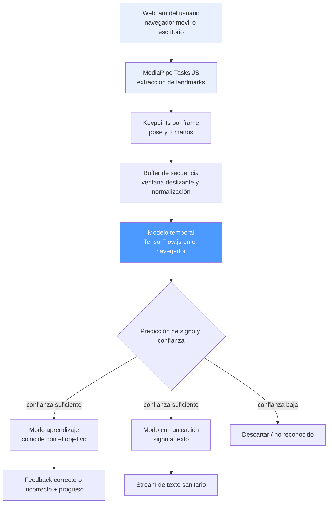
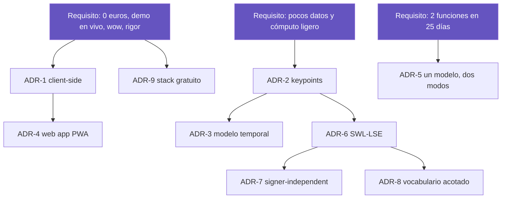

# Arquitectura y justificación de decisiones

Reconocedor de Lengua de Signos Española (LSE) · Proyecto final del máster de IA

Este documento registra las decisiones arquitectónicas del proyecto en formato ADR
(*Architecture Decision Record*): para cada decisión se indica **qué se decidió**, **qué
alternativas se consideraron**, **por qué** y **qué coste/limitación** asume. El objetivo
es que cada elección técnica sea defendible y trazable.

---

## Diagrama 1 — Arquitectura de inferencia (tiempo de ejecución)

**Lectura del diagrama:** todo ocurre en el dispositivo del usuario. No hay servidor de
inferencia. El mismo modelo alimenta las dos funciones; solo cambia qué se hace con la
predicción.

---

## Diagrama 2 — Pipeline de entrenamiento (offline, reproducible)

```mermaid
flowchart LR
    A["SWL-LSE<br/>keypoints MediaPipe<br/>300 signos, 124 signantes"] --> B["Selección de vocabulario<br/>40-60 signos mejor representados"]
    B --> C["Preprocesado<br/>normalización y longitud fija"]
    C --> D["Split SIGNER-INDEPENDENT<br/>train, val, test por signante"]
    D --> E["Data augmentation<br/>jitter, rotación, escala, time-warp"]
    E --> F["Entrenamiento<br/>Colab o Kaggle GPU"]
    F --> G["Tracking MLflow<br/>experimentos y métricas"]
    G --> H["Eval suite<br/>top-1, top-5, per-signer, matriz confusión"]
    H --> I["Modelo v1 congelado"]
    I --> J["Export a TensorFlow.js"]

    style D fill:#FF8B00,color:#fff
    style I fill:#36B37E,color:#fff
```

**Lectura del diagrama:** el split por signante (naranja) es anterior a todo lo demás,
para garantizar que ningún signante aparece en dos particiones. El modelo congelado
(verde) es el único artefacto que pasa a producción.

---

## ADR-1 · Inferencia en el navegador (client-side) en vez de API en servidor

**Decisión.** El modelo se ejecuta en el navegador del usuario con TensorFlow.js. La app
es un conjunto de archivos estáticos.

**Alternativas consideradas.**
- API REST con el modelo en un servidor (p. ej. FastAPI + contenedor en la nube).
- Inferencia en la nube gestionada (SageMaker, Vertex AI).

**Justificación.**
- **Latencia.** El reconocimiento de signos es en tiempo real (varios frames por
  segundo). Enviar keypoints a un servidor y esperar respuesta introduce un retardo que
  rompe la experiencia. En local, la inferencia es inmediata.
- **Coste.** Sin servidor no hay factura de cómputo ni de tráfico. El proyecto es 0 €,
  requisito del alumno (sin cuenta cloud).
- **Privacidad.** El vídeo de la cámara nunca sale del dispositivo — relevante en un caso
  de uso sanitario y de accesibilidad.
- **Despliegue trivial.** Archivos estáticos → hosting gratuito (GitHub Pages, Netlify…).

**Coste / limitación aceptada.** El modelo debe ser pequeño para correr fluido en el
navegador (limita el tamaño de la red). Se asume: el modelo temporal sobre keypoints es
ligero de por sí, así que encaja. Plan B si la conversión falla: API en Hugging Face
Spaces (gratis).

---

## ADR-2 · Entrada por keypoints (MediaPipe) en vez de vídeo crudo

**Decisión.** El modelo consume secuencias de *keypoints* (coordenadas de pose y manos)
extraídas por MediaPipe, no píxeles de vídeo.

**Alternativas consideradas.**
- CNN 3D / CNN+RNN sobre frames de vídeo crudo.
- Modelos de vídeo preentrenados (I3D, video transformers).

**Justificación.**
- **Coste computacional.** Procesar píxeles exige CNNs grandes y GPU potente. Los
  keypoints reducen cada frame a ~150 números → modelo pequeño, entrenable en Colab
  gratis y ejecutable en el navegador.
- **Invarianza.** Los keypoints abstraen fondo, iluminación, ropa y tono de piel. El
  modelo aprende el *gesto*, no la apariencia — generaliza mejor con pocos datos.
- **Disponibilidad de datos.** SWL-LSE ya distribuye los keypoints de MediaPipe
  extraídos: el formato de entrada coincide exactamente con la fuente de datos.
- **Enfoque del estado del arte.** Es el método estándar en reconocimiento de signos
  aislados con recursos limitados.

**Coste / limitación aceptada.** Se pierde información que no capturan los keypoints (p.
ej. matices finos de expresión facial). Para un vocabulario acotado de signos manuales es
asumible; se documenta como limitación.

---

## ADR-3 · Modelo temporal (Transformer / GRU) en vez de clasificador por frame

**Decisión.** Un modelo de secuencia (baseline GRU/LSTM → Transformer temporal) que
clasifica la secuencia completa de keypoints de un signo.

**Alternativas consideradas.**
- Clasificar frame a frame y votar (ignora la dinámica temporal).
- Modelos de grafos espacio-temporales (ST-GCN) sobre el esqueleto.

**Justificación.**
- **Un signo es movimiento, no una pose.** La información está en cómo evolucionan las
  manos en el tiempo; un modelo de secuencia lo captura de forma natural.
- **Progresión de complejidad.** Se empieza con GRU/LSTM (baseline sólido y rápido) y se
  sube a Transformer solo si la evaluación lo justifica — decisión guiada por datos, no
  por moda.
- **ST-GCN** es potente pero más complejo de implementar y desplegar en el navegador; se
  reserva como línea futura.

**Coste / limitación aceptada.** Los modelos de secuencia necesitan longitud fija
(padding/truncado), lo que exige segmentar dónde empieza y acaba el signo.

---

## ADR-4 · Web app / PWA en vez de app nativa

**Decisión.** Interfaz como web app instalable (PWA) que funciona en el navegador del
móvil.

**Alternativas consideradas.**
- App nativa Android/iOS (Flutter, React Native, nativo) con modelo on-device (TFLite).
- Demo local de escritorio (Streamlit).

**Justificación.**
- **Reparto de esfuerzo.** En 25 días, una app nativa consume días en trabajo NO-IA
  (build, tiendas, integración de cámara). La web app da el 90 % del efecto "es una app"
  con una fracción del esfuerzo, dejando el tiempo para el modelo.
- **Multiplataforma gratis.** Un solo código corre en móvil y escritorio.
- **Demo en vivo.** Se abre en el navegador del teléfono delante del tribunal sin
  instalar nada.
- **Encaja con client-side (ADR-1)** y con MediaPipe JS.

**Coste / limitación aceptada.** Menos acceso a APIs nativas y rendimiento algo inferior a
una app compilada. Irrelevante para esta demo. Envolver como app nativa queda como extra
si sobra tiempo.

---

## ADR-5 · Un modelo, dos funciones

**Decisión.** Las dos funciones (aprendizaje y comunicación) comparten el mismo modelo de
reconocimiento; solo difieren en la capa de aplicación.

**Alternativas consideradas.**
- Dos modelos independientes, uno por función.

**Justificación.**
- **El ML es el mismo problema:** "¿qué signo es este?". Lo que cambia es qué se hace con
  la respuesta (corregir vs mostrar texto).
- **Coste marginal casi nulo.** Añadir la segunda función es trabajo de interfaz, no de
  entrenamiento → hace viable "las dos" en 25 días.
- **Coherencia y mantenimiento:** un solo modelo que versionar, evaluar y desplegar.

**Coste / limitación aceptada.** Ambas funciones dependen de la calidad del mismo modelo:
si el reconocedor falla, fallan las dos. Se mitiga concentrando el esfuerzo en el modelo
antes de construir las interfaces.

---

## ADR-6 · SWL-LSE como dataset principal

**Decisión.** SWL-LSE (Zenodo, CC-BY 4.0) como fuente base; Sign4all opcional; grabaciones
propias para la demo.

**Alternativas consideradas.**
- Datasets de ASL (americana): WLASL, MS-ASL, dataset de Google (Kaggle).
- Grabar todo el dataset a mano.
- LSE_UVIGO (LSE continua).

**Justificación.**
- **Es LSE (español)**, no ASL: alineado con el objetivo y el hueco tecnológico real.
- **Keypoints MediaPipe ya extraídos** → coincide con la entrada del modelo (ADR-2).
- **124 signantes** → permite validación signer-independent (ADR-7) y generalización.
- **Descarga directa, licencia abierta**, sin comités ni solicitudes.
- **Vocabulario sanitario** → refuerza el caso de uso (barrera crítica en salud).

**Coste / limitación aceptada.** ~27 muestras/clase para 300 clases es poco → se acota el
vocabulario (ADR-8). LSE continua se descarta por ahora (problema de investigación).

---

## ADR-7 · Validación signer-independent

**Decisión.** Los splits train/val/test se hacen **por signante**: ningún signante
aparece en más de una partición.

**Alternativas consideradas.**
- Split aleatorio por muestra (lo habitual en tutoriales).

**Justificación.**
- **Evita fuga de datos (data leakage).** Con split aleatorio, el modelo puede memorizar
  el estilo de cada persona y dar una métrica inflada que no refleja el uso real (personas
  nuevas).
- **Mide lo que importa:** que funcione con signantes que nunca vio — el escenario real de
  la app.
- **Rigor defendible:** es la pregunta metodológica clave que un tribunal formulará;
  tenerla resuelta de antemano es un punto fuerte.

**Coste / limitación aceptada.** La métrica honesta será más baja que con split aleatorio.
Se asume y se explica: un número honesto vale más que uno inflado.

---

## ADR-8 · Vocabulario acotado (40-60 signos)

**Decisión.** Entrenar sobre un subconjunto de los signos mejor representados en vez de
las 300 clases completas.

**Alternativas consideradas.**
- Usar las 300 clases desde el principio.

**Justificación.**
- **Datos por clase.** Con ~27 muestras/clase, 300 clases dan un modelo débil. Acotar
  concentra los datos donde el modelo puede aprender bien.
- **Producto usable.** 40-60 signos bien reconocidos son más útiles (y demostrables) que
  300 con baja fiabilidad.
- **Escalabilidad demostrada.** "Escalar a 300 signos" queda como trabajo futuro claro y
  honesto.

**Coste / limitación aceptada.** Cobertura de vocabulario menor. Es una limitación
declarada y coherente con el encuadre de "prueba de concepto".

---

## ADR-9 · Stack gratuito de principio a fin

**Decisión.** Todo el proyecto usa herramientas gratuitas (sin cuenta cloud de pago).

**Justificación.**
- Requisito del alumno (sin cuenta AWS).
- **Reproducibilidad.** Cualquiera puede replicar el proyecto sin coste — valioso para la
  memoria.
- El diseño client-side (ADR-1) elimina el coste de servidor de raíz.

**Herramientas:** Colab/Kaggle (entrenar), MLflow local o DagsHub (tracking), GitHub Pages
/ Netlify / Vercel / HF Spaces (hosting), GitHub Actions (CI), Zenodo (datos).

**Coste / limitación aceptada.** No se demuestra MLOps en cloud gestionado (SageMaker,
etc.) en este proyecto; se compensa con MLOps reproducible ligero (pipeline, MLflow, CI,
evals, despliegue real).

---

## Trazabilidad de decisiones

