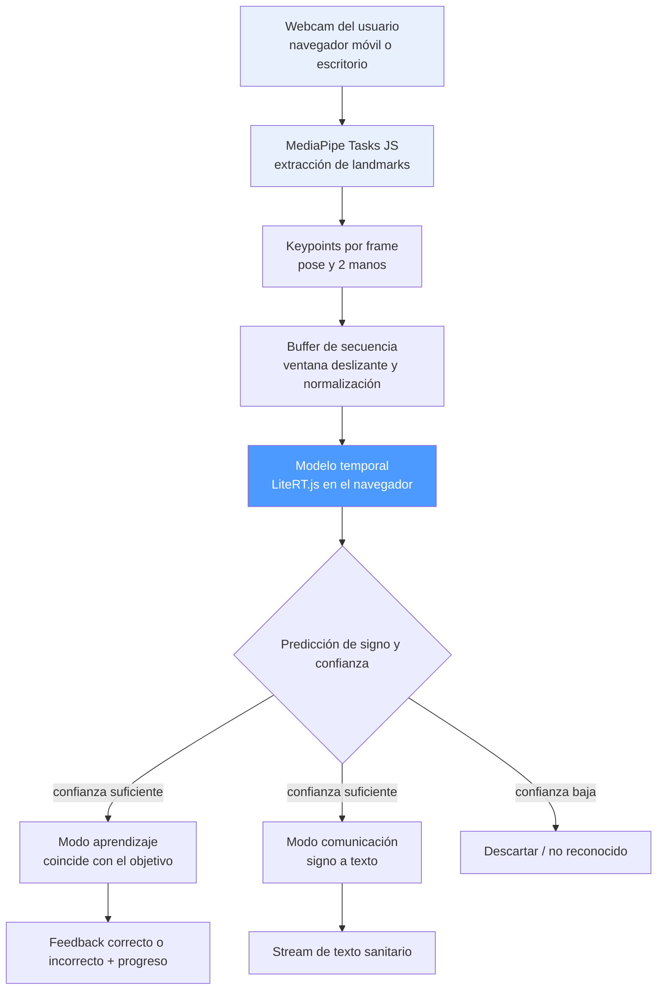
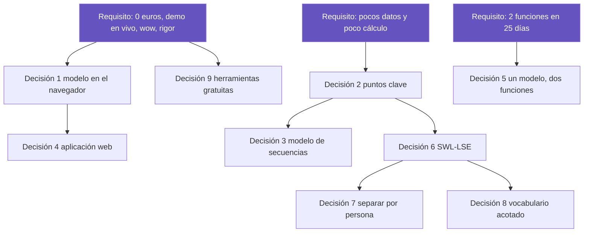

# Arquitectura y justificación de las decisiones

Reconocedor de Lengua de Signos Española. Proyecto final del máster de IA.

Este documento explica cómo está montado el proyecto y por qué se ha decidido así. Para
cada decisión importante se indica qué se eligió, qué otras opciones había, por qué se
tomó esa opción y qué limitación se asume a cambio. El objetivo es que cualquier persona
que lea el proyecto entienda el motivo de cada elección.

## Diagrama 1. Recorrido de la información cuando la aplicación está en uso

Lectura del diagrama. Todo ocurre en el dispositivo de la persona. No hay ningún servidor
que reciba la imagen. El mismo modelo alimenta las dos funciones y solo cambia qué se hace
con el resultado.

## Diagrama 2. Proceso de entrenamiento del modelo

Este proceso se hace una sola vez, antes de publicar la aplicación, y se puede repetir
cuando haga falta mejorar el modelo.

```mermaid
flowchart LR
    A["SWL-LSE<br/>keypoints MediaPipe<br/>300 signos, 124 signantes"] --> B["Selección de vocabulario<br/>40-60 signos mejor representados"]
    B --> C["Preprocesado<br/>normalización y longitud fija"]
    C --> D["Split SIGNER-INDEPENDENT<br/>train, val, test por signante"]
    D --> E["Data augmentation<br/>jitter, rotación, escala, time-warp"]
    E --> F["Entrenamiento<br/>Colab o Kaggle GPU"]
    F --> G["Tracking MLflow<br/>experimentos y métricas"]
    G --> H["Eval suite<br/>top-1, top-5, per-signer, matriz confusión"]
    H --> I["Modelo v1 congelado"]
    I --> J["Export a .tflite (LiteRT.js)"]

    style D fill:#FF8B00,color:#fff
    style I fill:#36B37E,color:#fff
```

Lectura del diagrama. La separación de los datos por persona, marcada en naranja, se hace
antes que cualquier otra cosa, para asegurar que ninguna persona aparece en dos grupos. El
modelo ya fijado, marcado en verde, es el único que pasa a la aplicación.

## Decisión 1. El modelo se ejecuta en el navegador, no en un servidor

Qué se decidió. El modelo funciona dentro del navegador de la persona con LiteRT.js, el
motor de Google para ejecutar modelos en la web, sucesor de TensorFlow.js y publicado en
julio de 2026. El modelo se convierte al formato .tflite, que es el que ejecuta LiteRT.js.
La aplicación son solo archivos que se sirven como una web normal.

Nota sobre la elección. Se valoró TensorFlow.js, más veterano, pero LiteRT.js es más rápido
y su conversión va incluida en TensorFlow, sin dependencias extra. Se comprobó que el modelo
convierte a .tflite usando solo operaciones nativas y da predicciones idénticas al original.
Si la conversión hubiera fallado, el plan alternativo era TensorFlow.js.

Otras opciones que se valoraron. Poner el modelo en un servidor y que la aplicación le
mande la información por internet para recibir la respuesta. También usar servicios de
inteligencia artificial en la nube.

Por qué se eligió esta opción.

- Velocidad. El reconocimiento es en tiempo real. Mandar la información a un servidor y
  esperar la respuesta introduce un retraso que estropea la experiencia. En el navegador la
  respuesta es inmediata.
- Coste. Sin servidor no hay factura. El proyecto tiene que ser gratuito porque no hay
  cuenta en la nube.
- Privacidad. La imagen de la cámara nunca sale del dispositivo, algo relevante en un caso
  de uso sanitario y de accesibilidad.
- Publicación sencilla. Al ser archivos estáticos se pueden alojar gratis en sitios como
  GitHub Pages.

Limitación que se asume. El modelo debe ser pequeño para ir fluido en el navegador. El
modelo que usamos, basado en secuencias de puntos, ya es ligero de por sí, así que encaja.
Si la conversión al navegador diera problemas, el plan alternativo es servir el modelo
desde Hugging Face Spaces, que es gratuito.

## Decisión 2. La entrada son puntos clave, no la imagen de vídeo

Qué se decidió. El modelo recibe secuencias de puntos clave, es decir, las posiciones de
las manos y el cuerpo que localiza MediaPipe, en lugar de la imagen de vídeo completa.

Otras opciones que se valoraron. Usar redes que procesan directamente los fotogramas de
vídeo, que son más pesadas y necesitan más capacidad de cálculo.

Por qué se eligió esta opción.

- Menos cálculo. Procesar imágenes completas exige redes grandes y tarjetas gráficas
  potentes. Los puntos clave reducen cada fotograma a unas pocas cifras, así que el modelo
  es pequeño y se puede entrenar en Colab gratis y ejecutar en el navegador.
- Se centra en el gesto. Los puntos clave dejan fuera el fondo, la ropa, la luz y el tono
  de piel. El modelo aprende el movimiento del signo y no la apariencia de la persona, lo
  que ayuda a que funcione con gente nueva.
- Encaja con los datos. SWL-LSE ya trae los puntos clave calculados, así que coinciden con
  lo que espera el modelo.

Limitación que se asume. Se pierden detalles que los puntos clave no recogen, como matices
finos de la expresión de la cara. Para un vocabulario de signos hechos con las manos es
asumible, y se deja indicado como limitación.

## Decisión 3. Un modelo que entiende secuencias en el tiempo

Qué se decidió. Un modelo que analiza la secuencia completa del signo. Se empieza con una
red pensada para datos en orden, y se prueba también un Transformer, que es un tipo de red
muy eficaz para este tipo de datos.

Otras opciones que se valoraron. Clasificar cada fotograma por separado y votar el
resultado, lo que ignora el movimiento. También usar redes específicas para esqueletos,
más complejas de montar.

Por qué se eligió esta opción.

- Un signo es movimiento, no una postura fija. La información está en cómo cambian las
  manos con el tiempo, y un modelo de secuencia lo capta de forma natural.
- Se avanza de lo simple a lo complejo. Se parte de un modelo sencillo que ya funciona bien
  y solo se sube a uno más avanzado si los resultados lo justifican. Así la decisión la
  guían los datos y no la moda.

Limitación que se asume. Este tipo de modelo necesita secuencias de una duración fija, lo
que obliga a decidir dónde empieza y dónde acaba cada signo.

## Decisión 4. Aplicación web instalable en lugar de aplicación de móvil nativa

Qué se decidió. La interfaz es una aplicación web que se puede instalar en el móvil y que
funciona en el navegador.

Otras opciones que se valoraron. Una aplicación de móvil nativa, es decir, hecha
específicamente para Android o iPhone. También una demostración de escritorio.

Por qué se eligió esta opción.

- Reparto del tiempo. En 25 días, una aplicación nativa consume muchos días en tareas que
  no son de inteligencia artificial, como la instalación y las tiendas de aplicaciones. La
  web ofrece casi el mismo efecto de aplicación con mucho menos esfuerzo, y deja tiempo
  para el modelo.
- Funciona en todas partes. Un solo desarrollo sirve para móvil y ordenador.
- Demostración fácil. Se abre en el navegador del teléfono delante del tribunal sin
  instalar nada.

Limitación que se asume. Se accede peor a las funciones propias del móvil y el rendimiento
es algo menor que en una aplicación nativa. Para esta demostración no supone un problema.
Envolverla como aplicación nativa queda como añadido si sobra tiempo.

## Decisión 5. Un solo modelo para las dos funciones

Qué se decidió. Las dos funciones, aprendizaje y comunicación, comparten el mismo modelo de
reconocimiento y solo se diferencian en lo que la aplicación hace con el resultado.

Otras opciones que se valoraron. Entrenar dos modelos separados, uno para cada función.

Por qué se eligió esta opción.

- El problema de fondo es el mismo, saber qué signo se está haciendo. Lo que cambia es si
  después se corrige a la persona o se muestra el texto.
- El coste añadido es casi nulo. Sumar la segunda función es trabajo de interfaz, no de
  entrenamiento, lo que hace posible tener las dos en 25 días.
- Es más fácil de mantener. Hay un único modelo que evaluar, versionar y publicar.

Limitación que se asume. Las dos funciones dependen de la calidad del mismo modelo. Si el
reconocimiento falla, fallan las dos. Por eso se concentra el esfuerzo en el modelo antes
de construir las interfaces.

## Decisión 6. SWL-LSE como fuente principal de datos

Qué se decidió. Usar SWL-LSE como base, Sign4all como refuerzo opcional y grabaciones
propias para la demostración.

Otras opciones que se valoraron. Conjuntos de datos de lengua de signos americana. También
grabar todos los datos a mano, o usar datos de lengua de signos continua, que es un
problema mucho más difícil.

Por qué se eligió esta opción.

- Es lengua de signos española, que es el objetivo del proyecto y donde hay un hueco real.
- Ya trae los puntos clave calculados, así que coincide con lo que espera el modelo.
- Tiene 124 personas distintas, lo que permite comprobar que el modelo funciona con gente
  nueva.
- Se descarga directamente y con licencia abierta, sin trámites ni permisos.
- Su vocabulario sanitario refuerza el motivo del proyecto, porque la salud es donde la
  barrera de comunicación es más grave.

Limitación que se asume. Hay pocos ejemplos por signo si se usan los 300, así que se acota
el vocabulario, como se explica en la decisión 8. La lengua de signos continua se descarta
por ahora por ser demasiado difícil para el plazo.

## Decisión 7. Evaluación con la separación oficial y una prueba con personas nuevas

Qué se decidió. Se usa la separación oficial en tres grupos que publican los autores del
conjunto de datos: entrenamiento, validación y prueba. Además, se reserva una prueba propia
con grabaciones de personas que no están en el conjunto de datos.

Contexto. Lo ideal para evaluar un reconocedor de signos es separar los datos por persona,
de modo que ninguna persona esté en más de un grupo. Si no se hace así, el modelo puede
memorizar la forma de signar de cada persona y dar una nota alta que no se corresponde con
el uso real, en el que aparecerán personas nuevas.

Qué se pudo hacer y qué no. Al explorar los datos se comprobó que la identidad de la
persona que hizo cada grabación no se publica. Los autores solo comparten los puntos del
cuerpo y las manos, por motivos de privacidad. Como falta ese dato, no es posible construir
una separación por persona propia ni verificar si la separación oficial la respeta.

Por qué se eligió esta opción.

- Usar el grupo de prueba oficial que los autores reservan es una práctica habitual y
  correcta.
- Grabar signos de personas ajenas al conjunto de datos, empezando por el propio autor del
  proyecto, ofrece la prueba de generalización más sincera posible. Si el modelo acierta
  con alguien a quien no ha visto nunca, demuestra que ha aprendido el signo y no a la
  persona.
- Ser transparente sobre lo que se puede verificar y lo que no es, en sí mismo, un punto de
  rigor.

Limitación que se asume. No se puede garantizar que la separación oficial esté hecha por
persona, y así se hará constar en la memoria. La prueba con personas nuevas compensa en
parte esta limitación, aunque sea con pocas personas.

## Decisión 8. Vocabulario acotado de 40 a 60 signos

Qué se decidió. Entrenar con un grupo reducido de los signos que más ejemplos tienen, en
lugar de los 300 completos.

Otra opción que se valoró. Usar los 300 signos desde el principio.

Por qué se eligió esta opción.

- Con unos 27 ejemplos por signo, 300 signos dan un modelo débil. Acotar concentra los
  datos donde el modelo sí puede aprender bien.
- Un producto usable. De 40 a 60 signos bien reconocidos son más útiles y más fáciles de
  demostrar que 300 poco fiables.
- Deja claro el camino de mejora. Ampliar a 300 signos queda como trabajo futuro concreto.

Limitación que se asume. La aplicación reconoce menos vocabulario. Es una limitación
declarada y coherente con el planteamiento de prueba de concepto.

## Decisión 9. Herramientas gratuitas de principio a fin

Qué se decidió. Todo el proyecto usa herramientas gratuitas, sin ninguna cuenta de pago.

Por qué se eligió esta opción.

- Es un requisito, porque no hay cuenta en la nube.
- Cualquiera puede reproducir el proyecto sin gastar dinero, algo valioso para la memoria.
- El diseño de ejecutar el modelo en el navegador elimina el gasto de servidor desde el
  principio.

Herramientas. Colab o Kaggle para entrenar, MLflow en local o DagsHub para el registro de
experimentos, GitHub Pages u opciones similares para alojar la aplicación, GitHub Actions
para la automatización y Zenodo para los datos.

Limitación que se asume. En este proyecto no se demuestra el uso de servicios gestionados
de inteligencia artificial en la nube. Se compensa con prácticas de MLOps más ligeras pero
igual de válidas, como el proceso reproducible, el registro de experimentos, la
automatización, la evaluación y un despliegue real.

## Cómo se relacionan las decisiones

